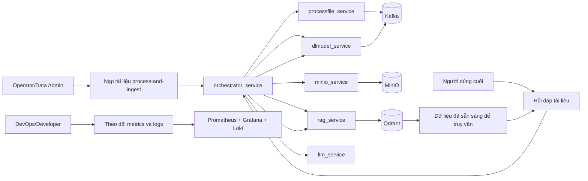
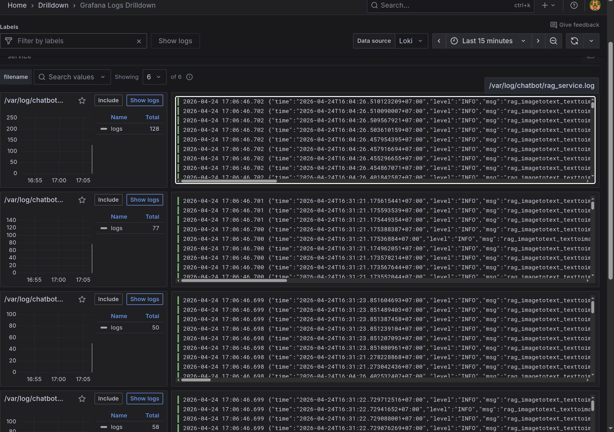
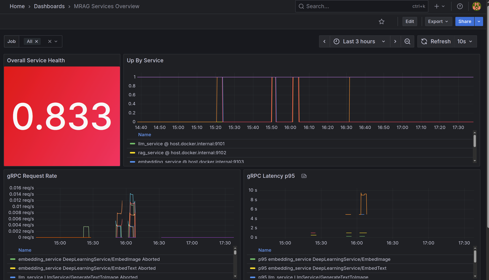
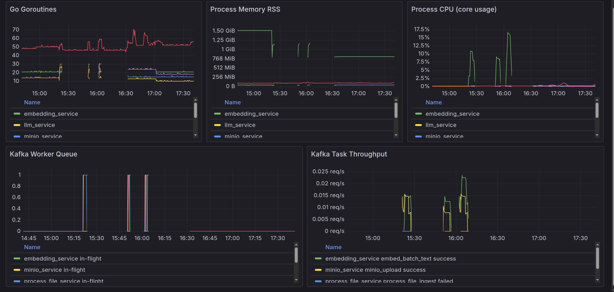
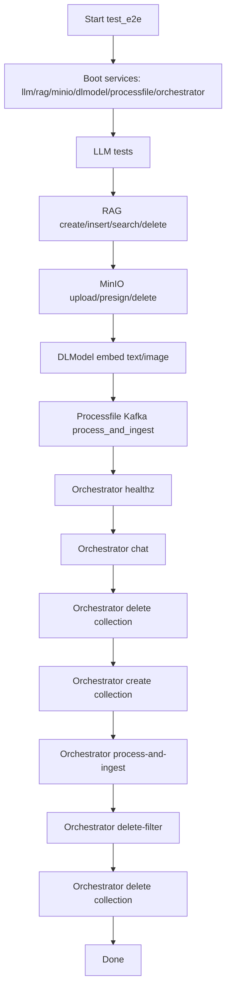

# mRAG for Slide/PDF Documents

Hệ thống `rag_imtotext_texttoim` là nền tảng **multimodal RAG** cho tài liệu PDF/slide, gồm:
- pipeline nạp dữ liệu (download -> parse -> embedding -> vector DB),
- pipeline chat hội thoại theo **session**,
- quan sát vận hành với Prometheus + Grafana + Loki.

Mục tiêu chính là trả lời câu hỏi bám ngữ cảnh tài liệu, tận dụng cả `text_dense` và `image_dense` khi dữ liệu có ảnh.

## Dự án Cá Nhân (Ownership)

Đây là dự án cá nhân mình tự thiết kế, triển khai và vận hành end-to-end, bao gồm:
- Thiết kế kiến trúc đa service và hiện thực code (Go + tích hợp ONNX C++),
- Xây dựng luồng ingest và luồng chat theo session,
- Xây dựng bộ test và tự động hóa CI/CD trên GitLab,
- Thiết kế monitoring/observability (Prometheus/Grafana/Loki/Promtail) và quy trình xử lý sự cố.

## 1. Kiến trúc tổng quan

Các service chính:
- `orchestrator_service` (HTTP API): điều phối chat, vectordb API, process-and-ingest.
- `rag_service` (gRPC): tạo/xóa collection, insert/search/delete point trên Qdrant.
- `dlmodel_service` (gRPC + Kafka): sinh embedding text/image bằng ONNX C++ bridge.
- `llm_service` (gRPC): gọi LLM cloud để preprocess và answer.
- `minio_service` (gRPC + Kafka): upload/presign/delete file MinIO.
- `processfile_service` (gRPC): xử lý tài liệu (marker/chunking hỗ trợ pipeline ingest).

Hạ tầng:
- Qdrant (vector DB), Kafka, MinIO.
- Monitoring stack: Prometheus, Grafana, Loki, Promtail.

Luồng chính:
- Ingest: `orchestrator -> minio/processfile/dlmodel/rag -> qdrant`
- Chat: `orchestrator -> llm + dlmodel + rag -> llm`

### Use Case Diagram



Ghi chú: người dùng cuối chỉ chat hiệu quả sau khi có dữ liệu đã ingest vào Qdrant (text/image vectors + payload).

## 2. Công nghệ sử dụng

- Backend: Go
- Embedding runtime: C++ + ONNX Runtime
- Transport: gRPC + HTTP REST
- Messaging: Kafka
- Object storage: MinIO
- Vector DB: Qdrant
- Monitoring: Prometheus + Grafana + Loki + Promtail
- CI/CD: GitLab CI
- PDF/Slide parsing: Marker (`marker_single`)

## 2.1 Mô hình embedding lấy như nào?

Hệ embedding trong dự án gồm 2 model ONNX:
- `jina_text.onnx` (text embedding),
- `jina_vision.onnx` (image embedding),
- kèm tokenizer `vocab.txt`.

Nguồn và cách nạp model trong runtime:
1. Model artifact được đặt ở thư mục host riêng (`~/projects/mrag/model`).
2. Trong CI `build`, artifact được copy vào workspace:
   - `cp -r ~/projects/mrag/model third_party/onnx_c++/`
3. File cấu hình embedding (`third_party/onnx_c++/config/config.yaml`) trỏ tới:
   - `model/onnx/jina_text.onnx`
   - `model/onnx/jina_vision.onnx`
   - `model/tokenizer/vocab.txt`
4. `dlmodel_service` đọc path config qua biến:
   - `EMBEDDING_SERVICE_JINA_CONFIG=../../third_party/onnx_c++/config/config.yaml`

Phần ONNX Runtime:
- CI ưu tiên tải gói GPU `onnxruntime-linux-x64-gpu-<version>.tgz`.
- Nếu runner thiếu `libcudnn.so.9`, pipeline tự fallback sang gói CPU và đổi config runtime sang `config.ci.cpu.yaml`.

## 2.2 Quick Start (local/dev)

### Yêu cầu môi trường

- Docker + Docker Compose
- Go (khuyến nghị >= 1.22)
- `grpcurl`, `jq`, `curl`
- (tuỳ chọn GPU) CUDA + cuDNN nếu muốn chạy ONNX Runtime GPU
- Marker CLI (`marker_single`) để parse PDF/slide ra markdown + artifact ảnh
- Khuyến nghị GPU cho Marker: VRAM > 12 GB (ít hơn vẫn có thể chạy nhưng chậm hoặc dễ OOM với file nặng)

### Bước 1: Chuẩn bị env

```bash
cd /home/minhtk/code/rag_imtotext_texttoim/worktree/main
cp config/.env.dev config/.env
```

Nếu chạy theo profile test:

```bash
cp config/.env.test config/.env
```

### Bước 2: Khởi động hạ tầng + services

```bash
docker compose --env-file config/.env -f docker_compose_dev.yaml up -d
```

### Bước 2.1: Kiểm tra/cài Marker

Pipeline ingest gọi trực tiếp lệnh `marker_single` (xem `internal/.../marker_single_file.sh`), nên máy chạy cần có command này trong `PATH`.
Để parse tài liệu ổn định, nên dùng máy có GPU VRAM > 12 GB cho Marker.

Ví dụ cài nhanh:

```bash
python3 -m pip install marker-pdf
marker_single --help
```

### Bước 3: Kiểm tra orchestrator health

```bash
curl -sS "http://${SERVICE_HOST:-100.105.80.22}:${ORCHESTRATOR_SERVICE_PORT:-18080}/healthz" | jq .
```

### Bước 4: Chạy nhanh test smoke

```bash
cd test_cases
bash setup.sh
bash orchestrator_service_test_healthz.sh
```

Hoặc chạy full E2E:

```bash
bash run_all_tests.sh
```

## 2.3 Ví dụ API (copy chạy ngay)

Lưu ý luồng đúng cho user cuối:
1. tạo collection,
2. ingest tài liệu,
3. chat theo `session_id`,
4. cleanup collection khi cần.

### 1) Healthz

```bash
BASE_URL="http://${SERVICE_HOST:-100.105.80.22}:${ORCHESTRATOR_SERVICE_PORT:-18080}"
curl -sS "${BASE_URL}/healthz" | jq .
```

### 2) Tạo collection

```bash
BASE_URL="http://${SERVICE_HOST:-100.105.80.22}:${ORCHESTRATOR_SERVICE_PORT:-18080}"
curl -sS -X POST "${BASE_URL}/api/v1/orchestrator/vectordb/collections" \
  -H "Content-Type: application/json" \
  -d '{
    "name": "ai_sota_0022"
  }' | jq .
```

### 3) Ingest tài liệu (process-and-ingest)

```bash
BASE_URL="http://${SERVICE_HOST:-100.105.80.22}:${ORCHESTRATOR_SERVICE_PORT:-18080}"
curl -sS -X POST "${BASE_URL}/api/v1/orchestrator/training-file/process-and-ingest" \
  -H "Content-Type: application/json" \
  -d '{
    "uuid": "ai_sota_0022",
    "url_download": "http://localhost:8000/download/ai_sota_0022.pdf",
    "lang": "vi",
    "timeout_seconds": 900
  }' | jq .
```

### 4) Chat theo session (text-only)

```bash
BASE_URL="http://${SERVICE_HOST:-100.105.80.22}:${ORCHESTRATOR_SERVICE_PORT:-18080}"
curl -sS -X POST "${BASE_URL}/api/v1/orchestrator/chat" \
  -H "Content-Type: application/json" \
  -d '{
    "session_id": "session_demo_001",
    "query": "Noi dung tai lieu nay la gi?",
    "image_path": "",
    "Uuid": "ai_sota_0022"
  }' | jq .
```

### 5) Xóa collection (cleanup)

```bash
BASE_URL="http://${SERVICE_HOST:-100.105.80.22}:${ORCHESTRATOR_SERVICE_PORT:-18080}"
curl -sS -X POST "${BASE_URL}/api/v1/orchestrator/vectordb/collections/delete" \
  -H "Content-Type: application/json" \
  -d '{
    "name": "ai_sota_0022"
  }' | jq .
```

Lưu ý:
- Trường request chat hiện tại đang dùng key `Uuid` (chữ `U` hoa) theo source hiện tại.
- Nếu collection chưa có `image_dense` mà truyền `image_path`, retrieval mode ảnh có thể fail.

## 3. Mô tả từng service

### 3.1 `orchestrator_service`
- Entry point HTTP cho:
  - `POST /api/v1/orchestrator/chat`
  - `POST /api/v1/orchestrator/training-file/process-and-ingest`
  - nhóm API vectordb create/delete/delete-filter
  - `GET /healthz`
- Quản lý session in-memory với TTL (`session_ttl_seconds`).
- Với chat:
  - tạo/kiểm tra session,
  - preprocess query qua `llm_service`,
  - gọi `dlmodel_service` để embed query,
  - gọi `rag_service` để retrieve context,
  - gọi `llm_service` lần 2 để sinh câu trả lời cuối.
- Nếu `image_path` là URL HTTP/HTTPS, service tải ảnh về `data/tmp/<session_id>/...` và tự dọn khi session bị release.

### 3.2 `rag_service`
- Adapter gRPC tới Qdrant.
- Hỗ trợ collection/vector operations và search payload.
- Dùng trong cả chat retrieval và pipeline ingest.

### 3.3 `dlmodel_service`
- Bridge từ Go sang ONNX C++ runtime.
- Consumer Kafka cho batch embedding (text/image), publish result topic tương ứng.
- Có metrics cho queue/in-flight/processing time.

### 3.4 `llm_service`
- Service gRPC cho text-to-text và text-to-image prompt flow.
- Dùng cho:
  - preprocess intent/query,
  - answer synthesis,
  - postprocess answer (nếu bật prompt hậu xử lý).

### 3.5 `minio_service`
- Xử lý upload/presign/delete file.
- Tích hợp Kafka để phục vụ pipeline async.

### 3.6 `processfile_service`
- Hỗ trợ xử lý tài liệu đầu vào thành markdown/chunk.
- Dùng trong luồng training file process-and-ingest.

## 4. Luồng ingest tài liệu (process-and-ingest)

Luồng chuẩn theo `orchestrator`:
1. Download file về `data/download/<uuid>`.
2. Chạy `marker` để chuyển PDF thành markdown + artifact ảnh/layout vào `data/processed/<uuid>`.
3. Upload artifact lên MinIO.
4. Đọc markdown, parse chunk, semantic merge.
5. Embed text (bắt buộc) và image (optional).
6. Upsert vào Qdrant với payload `doc_id`, `chunk_index`, `source_path`, ...
7. Verify dữ liệu bằng truy vấn kiểm tra.

Kết quả trả về gồm `uploaded_files`, `inserted_points`, `verified`, `latency_ms`.

### 4.1 Semantic Chunking (chi tiết)

Semantic chunking trong pipeline hiện tại không chỉ tách câu theo rule, mà còn hợp nhất theo ngữ nghĩa:

1. Parse markdown thành các segment ban đầu (sau khi lọc noise/header/số trang...).
2. Embed toàn bộ segment text bằng `dlmodel_service`.
3. Validate embedding:
   - loại vector zero-norm,
   - loại embedding sai dimension.
4. Tính cosine similarity giữa các segment liền kề.
5. Nếu similarity `>= semantic_similarity_threshold` thì gộp vào cùng semantic group, ngược lại mở group mới.
6. Chạy `mergeChunksBySemantic(...)` để tạo chunk cuối cùng có chất lượng retrieval tốt hơn.
7. Xuất payload `unit_type=semantic_chunk` cùng metadata (`doc_id`, `chunk_index`, `token_count`, `source_path`, ...).

Các tham số chính (đọc từ config):
- `semantic_similarity_threshold` (ví dụ `0.85`): ngưỡng quyết định có gộp hay không.
- `min_chunk_chars`, `min_chunk_tokens`, `max_chunk_tokens`: kiểm soát độ dài chunk.
- `chunk_overlap_sentences`: kiểm soát overlap giữa các chunk để giảm mất ngữ cảnh biên.

Ý nghĩa thực tế:
- giảm phân mảnh chunk quá nhỏ,
- tăng coherence của context khi retrieve,
- cải thiện chất lượng câu trả lời cuối ở bước chat.

## 5. Luồng chat theo session

Các điểm quan trọng:
- Session key: `session_id`.
- Nếu session chưa tồn tại -> tạo mới.
- Lưu lịch sử hội thoại, lấy `memory_history_top_k` để đưa vào bước answer.
- Retrieval có thể skip tùy intent/điều kiện.
- Nếu chat có ảnh:
  - embed ảnh,
  - search vector `image_dense`,
  - combine với `text_dense` retrieval để chọn context tốt nhất.

Lưu ý:
- Collection chat mặc định thường là `uuid` tài liệu đã ingest.
- Nếu collection không có `image_dense`, chat có ảnh sẽ lỗi truy vấn vector name.

## 6. Monitoring và observability

### 6.1 Metrics
- Prometheus scrape các target:
  - `host.docker.internal:9101` (`llm_service`)
  - `host.docker.internal:9102` (`rag_service`)
  - `host.docker.internal:9103` (`embedding_service`)
  - `host.docker.internal:9104` (`minio_service`)
  - `host.docker.internal:9105` (`process_file_service`)

### 6.2 Logs
- Promtail tail `PROMTAIL_LOG_PATH` (mặc định `/var/log/chatbot/*.log`).
- Log labels chính:
  - `service_name` (derive từ tên file log),
  - `level`,
  - `env`.

### 6.3 Dashboard
- File dashboard custom trong repo:
  - `monitoring/grafana/dashboard_rag_services.json` (ở nhánh develop)
- Datasource Grafana:
  - Prometheus (`uid: prometheus`)
  - Loki (`uid: loki`)

### 6.4 Ảnh monitoring

> Đã chèn 3 khung ảnh monitoring trong README.  
> Đặt file ảnh vào `docs/monitoring/` với đúng tên bên dưới để hiển thị trực tiếp.





## 7. GitLab CI/CD

Pipeline gồm các stage:
- `build`
- `rebuild_docker`
- `test_e2e`
- `deploy`
- `checklog`

Điểm đáng chú ý:
- Build ONNX runtime ưu tiên GPU (`ORT_USE_CUDA=ON`).
- Nếu runner thiếu `libcudnn.so.9` -> fallback CPU package và rewrite config runtime embedding cho CI.
- `test_e2e` chạy toàn bộ test cases theo thứ tự đã chuẩn hóa.
- `deploy` copy artifact sang thư mục runtime trên host runner.

[[Result của pipeline CI trên GitLab]](docs/cicd/result_pipeline.png)

## 8. Vận hành nhiều cụm/máy theo machine ID

Thực tế dự án đang map theo:
- runner tag (ví dụ `gpu_1650ti`),
- env file trên host runner (`~/envs/mrag/.env.test`, `~/envs/mrag/.env.dev`),
- thư mục deploy riêng trên host (`/home/gitlab-runner/projects/mrag`).

Khuyến nghị chuẩn hóa nhiều cụm theo `MACHINE_ID`:
- Mỗi máy có `MACHINE_ID` riêng.
- Tách env theo máy: `.env.test.<MACHINE_ID>`, `.env.dev.<MACHINE_ID>`.
- Tách deploy path theo máy: `/projects/mrag/<MACHINE_ID>/...`.

Ví dụ ý tưởng CI:
```yaml
variables:
  MACHINE_ID: "gpu_1650ti"
script:
  - cp "~/envs/mrag/.env.test.${MACHINE_ID}" ./config/.env
  - export folder_project="/home/gitlab-runner/projects/mrag/${MACHINE_ID}"
```

## 9. Test case và thứ tự chạy

Mọi test script nằm tại `test_cases/` và dùng chung `_common.sh` để load env + host/port.

### 9.1 Nhóm test theo service

- `llm_service`
  - `llm_service_test_text_to_text.sh`: gọi `LlmService.GenerateTextToText`.
  - `llm_service_test_text_to_image.sh`: gọi `LlmService.GenerateTextToImage` với ảnh local.
- `dlmodel_service`
  - `dlmodel_service_test_embedding_text.sh`: kiểm tra `EmbedText`.
  - `dlmodel_service_test_embedding_image.sh`: đọc ảnh, encode payload, kiểm tra `EmbedImage`.
- `rag_service`
  - `rag_service_test_createcollection.sh`
  - `rag_service_test_insertpoints.sh`
  - `rag_service_test_searchpoints.sh`
  - `rag_service_test_deletepointfillter.sh`
  - `rag_service_test_deletecollection.sh`
- `minio_service`
  - `minio_service_test_uploadfile.sh`: publish request qua Kafka và chờ result topic.
  - `minio_service_test_presignuploadurl.sh`
  - `minio_service_test_deletefile.sh`
- `processfile_service`
  - `processfile_service_test_process_and_ingest.sh`: publish Kafka event `process_and_ingest`, poll kết quả theo `correlation_id`.
- `orchestrator_service`
  - `orchestrator_service_test_healthz.sh`
  - `orchestrator_service_test_chat.sh`
  - `orchestrator_service_test_vectordb_createcollection.sh`
  - `orchestrator_service_test_vectordb_deletecollection.sh`
  - `orchestrator_service_test_vectordb_deletefilter.sh`
  - `orchestrator_service_test_process_and_ingest.sh`

### 9.2 Thứ tự chạy tổng quát (CI `test_e2e`)

Thứ tự thực thi trong pipeline được thiết kế theo hướng:
- smoke từng service lõi trước,
- sau đó mới chạy luồng điều phối orchestrator,
- cleanup dữ liệu để chạy lặp lại không bẩn trạng thái.

Luồng tổng quát:
1. LLM tests
2. RAG CRUD/Search cơ bản
3. MinIO upload/presign/delete
4. Embedding tests
5. Process file ingest qua Kafka
6. Orchestrator sequence (healthz/chat/vectordb/process-and-ingest/cleanup)

Sơ đồ luồng chạy:


## 10. Cấu trúc thư mục quan trọng

- `cmd/`: entrypoint từng service
- `internal/`: usecase/adapter/bootstrap/infra
- `config/`: `.env.*` và `config.yaml`
- `monitoring/`: Prometheus, Grafana datasource, Loki, Promtail
- `test_cases/`: script e2e/smoke
- `third_party/onnx_c++/`: runtime embedding C++
