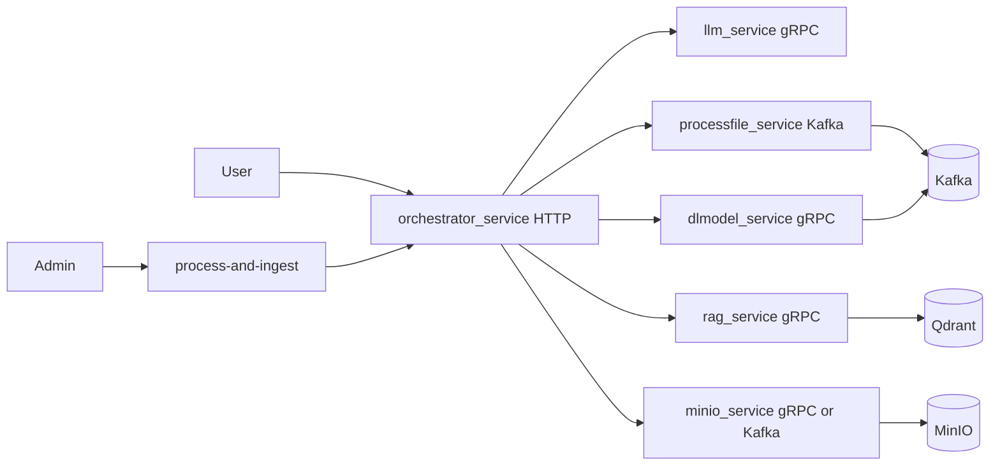
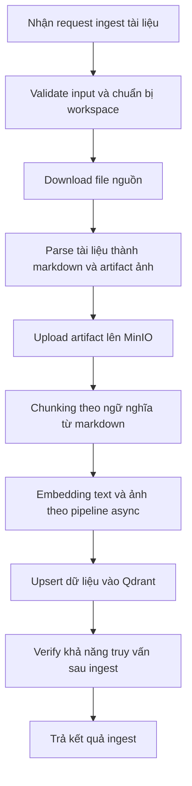
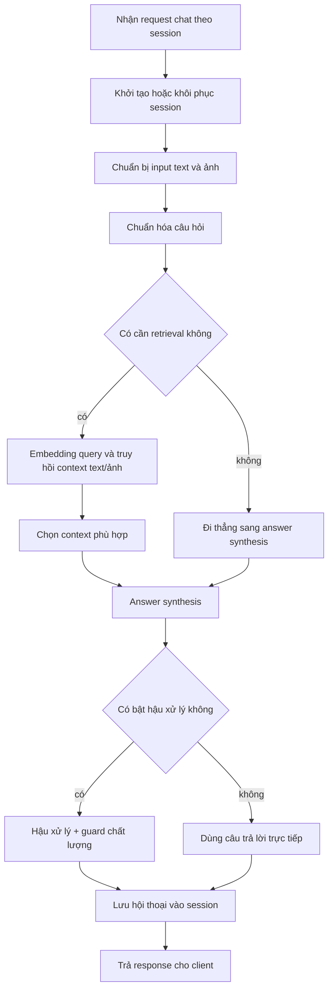
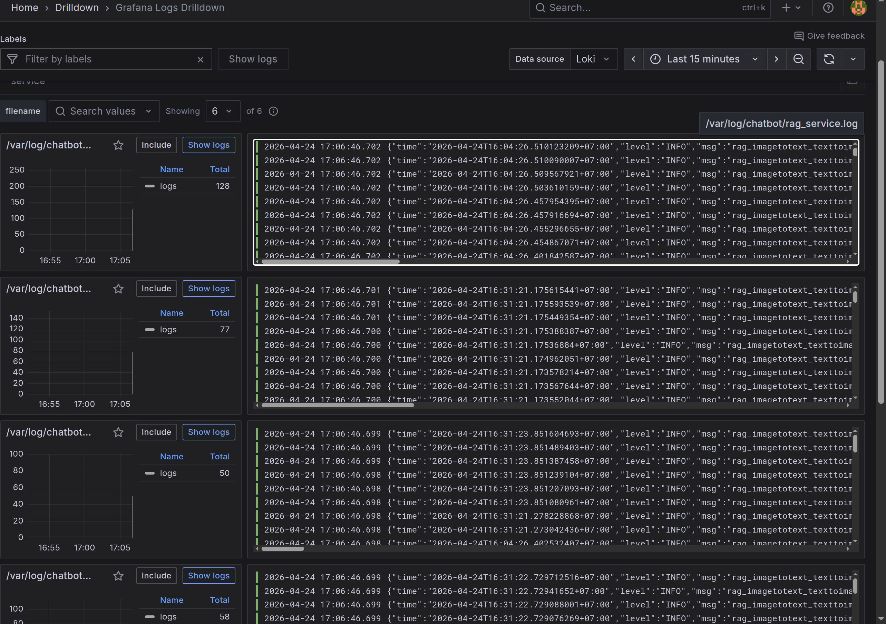
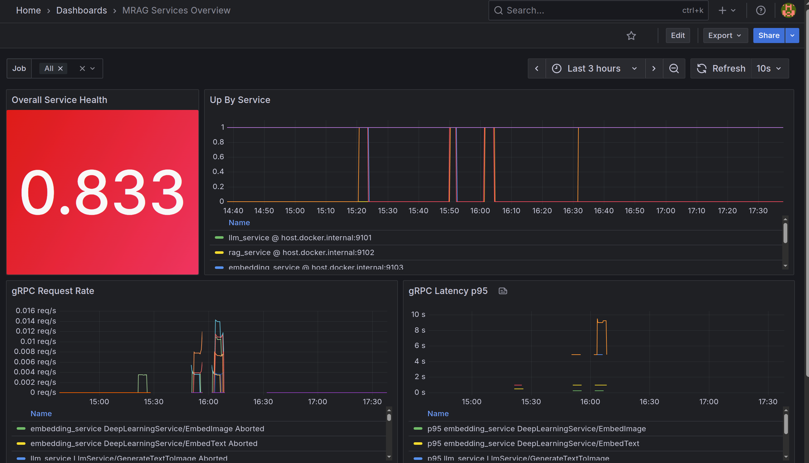
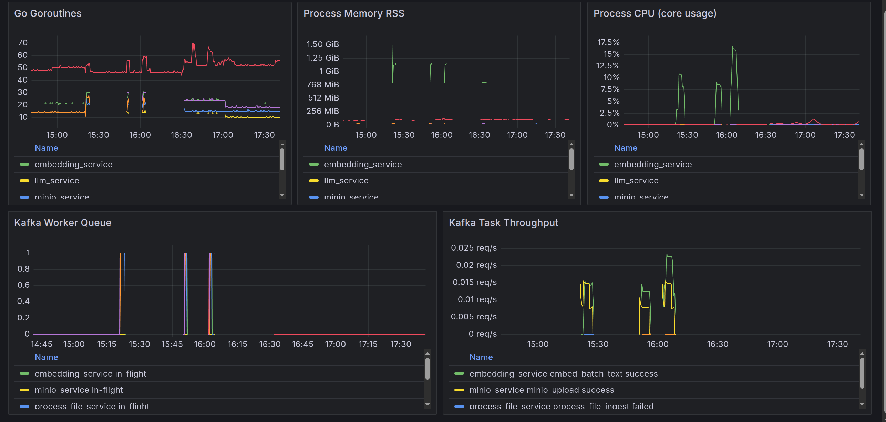
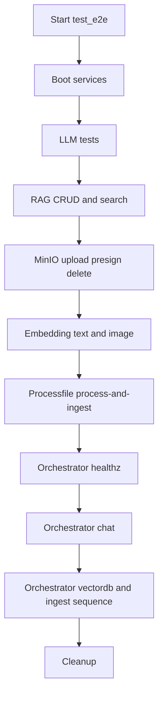

# mRAG for Slide/PDF Documents

Hệ thống `rag_imtotext_texttoim` là nền tảng **multimodal RAG** cho tài liệu PDF/slide, gồm:
- pipeline nạp dữ liệu tài liệu vào vector database,
- pipeline chat theo session với ngữ cảnh retrieval,
- quan sát vận hành bằng Prometheus + Grafana + Loki.

Code runtime chính: thư mục root hiện tại của project (`.`).

## Mô tả dự án

`rag_imtotext_texttoim` là hệ thống hỏi đáp tài liệu đa phương thức (multimodal RAG) cho PDF/slide, xử lý theo chuỗi:
- lấy tài liệu đầu vào,
- phân tích và tách nội dung bằng marker,
- tạo embedding cho text và image,
- lưu dữ liệu vào Qdrant để truy vấn ngữ cảnh,
- sinh câu trả lời qua luồng chat theo session.

Mục tiêu của hệ là giúp người dùng đặt câu hỏi tự nhiên và nhận câu trả lời bám tài liệu nguồn, thay vì trả lời chung chung theo kiến thức nền của mô hình.

## Dự án Cá Nhân (Ownership)

Đây là **dự án cá nhân** được xây dựng và vận hành end-to-end, bao gồm:
- thiết kế kiến trúc đa service và giao tiếp HTTP/gRPC/Kafka,
- triển khai pipeline ingest + chat multimodal,
- tích hợp ONNX C++ runtime cho embedding text/image,
- xây test integration/E2E, CI/CD và monitoring runtime.

## 1. Mục tiêu hệ thống

- Trả lời câu hỏi bám nội dung tài liệu đã ingest.
- Hỗ trợ cả retrieval text (`text_dense`) và retrieval ảnh (`image_dense`) khi dữ liệu có hình.
- Vận hành theo kiến trúc đa service để tách trách nhiệm rõ ràng.
- Có test integration/E2E và hệ monitoring cho runtime.

## 2. Kiến trúc tổng quan

### 2.1 Thành phần service

- `orchestrator_service` (HTTP API): entrypoint cho chat, vectordb API, process-and-ingest.
- `rag_service` (gRPC): tạo/xóa collection, insert/search/delete point trên Qdrant.
- `dlmodel_service` (gRPC + Kafka): embedding text/image qua ONNX C++ bridge.
- `llm_service` (gRPC): preprocess query, answer synthesis, postprocess answer.
- `minio_service` (gRPC + Kafka): upload/presign/delete file trên MinIO.
- `processfile_service` (Kafka worker): chạy pipeline xử lý tài liệu bất đồng bộ.

### 2.2 Hạ tầng

- Vector DB: Qdrant
- Messaging: Kafka
- Object storage: MinIO
- Monitoring stack: Prometheus, Grafana, Loki, Promtail

### 2.3 Runtime map


```mermaid
flowchart LR
  U[User] --> ORCH[orchestrator_service HTTP]
  ORCH --> LLM[llm_service gRPC]
  ORCH --> DLM[dlmodel_service gRPC]
  ORCH --> RAG[rag_service gRPC]
  RAG --> QD[(Qdrant)]

  A[Admin] --> INGEST[process-and-ingest]
  INGEST --> ORCH
  ORCH --> PF[processfile_service Kafka]
  ORCH --> MINIO[minio_service gRPC or Kafka]
  PF --> K[(Kafka)]
  DLM --> K
  MINIO --> MO[(MinIO)]
```

## 3. Luồng hoạt động chi tiết

### 3.1 Luồng train/ingest (`process-and-ingest`)


```mermaid
flowchart TD
  A[Nhận request ingest tài liệu] --> B[Validate input và chuẩn bị workspace]
  B --> C[Download file nguồn]
  C --> D[Parse tài liệu thành markdown và artifact ảnh]
  D --> E[Upload artifact lên MinIO]
  E --> F[Chunking theo ngữ nghĩa từ markdown]
  F --> G[Embedding text và ảnh theo pipeline async]
  G --> H[Upsert dữ liệu vào Qdrant]
  H --> I[Verify khả năng truy vấn sau ingest]
  I --> J[Trả kết quả ingest]
```

### 3.2 Luồng chat theo session


```mermaid
flowchart TD
  A[Nhận request chat theo session] --> B[Khởi tạo hoặc khôi phục session]
  B --> C[Chuẩn bị input text và ảnh]
  C --> D[Chuẩn hóa câu hỏi]
  D --> E{Có cần retrieval không}
  E -->|không| F[Đi thẳng sang answer synthesis]
  E -->|có| G[Embedding query và truy hồi context text/ảnh]
  G --> H[Chọn context phù hợp]
  H --> I[Answer synthesis]
  F --> I
  I --> J{Có bật hậu xử lý không}
  J -->|có| K[Hậu xử lý + guard chất lượng]
  J -->|không| L[Dùng câu trả lời trực tiếp]
  K --> M[Lưu hội thoại vào session]
  L --> M
  M --> N[Trả response cho client]
```

## 4. Marker + Semantic Chunking

### 4.1 Marker stage trong ingest

`marker_single_file.sh` là lớp adapter ở bước ingest, với vai trò:
- Đóng vai trò adapter để chuẩn hóa bước parse tài liệu sang cùng một định dạng artifact cho pipeline ingest.
- Thực hiện preflight check để đảm bảo `marker_single` sẵn sàng trước khi xử lý.
- Thiết kế idempotent: nếu artifact đã tồn tại thì không parse lại, tránh lãng phí tài nguyên.
- Mục tiêu đầu ra là bộ artifact gồm markdown và ảnh để các bước upload/chunking dùng lại nhất quán.

Sau bước marker:
- hệ thống quét toàn bộ artifact văn bản và hình ảnh được tạo ra,
- upload artifact lên MinIO,
- lấy markdown làm nguồn cho chunking.

### 4.2 Ý tưởng semantic chunking

Pipeline semantic chunking gồm nhiều lớp:

1. Tách token dòng từ markdown:
- tách phần nội dung văn bản và tham chiếu ảnh thành các đơn vị xử lý ban đầu,
- chia văn bản thành các câu/đoạn ngắn để chuẩn bị cho bước gộp theo ngữ nghĩa.

2. Ổn định sentence units:
- loại các đơn vị mang tính nhiễu hoặc thiếu nội dung ngữ nghĩa,
- gộp các mảnh quá nhỏ vào ngữ cảnh lân cận để tránh phân mảnh quá mức.

3. Embedding và quality gates:
- tạo embedding theo lô bất đồng bộ để giữ throughput ổn định,
- loại các kết quả embedding không hợp lệ trước khi đưa vào retrieval.

4. Semantic merge:
- tính cosine similarity giữa các chunk kề nhau,
- merge khi:
  - hai đoạn đủ gần nhau về ngữ nghĩa,
  - và độ dài sau khi gộp vẫn nằm trong ngưỡng vận hành an toàn.
- vector chunk merged được tính bằng average vector.

5. Hậu xử lý chunk:
- sửa các mảnh quá ngắn, tách các mảnh quá dài, và thêm chồng lấn ngữ cảnh ở biên,
- mục tiêu là giữ cân bằng giữa tính mạch lạc và khả năng truy hồi chính xác.

### 4.3 Ý tưởng cấu hình chunking

Thay vì nhìn như các con số rời rạc, nhóm cấu hình chunking được thiết kế theo 5 ý tưởng vận hành:
- Chỉ gộp khi hai đoạn thực sự cùng mạch nghĩa, để tránh trộn sai ngữ cảnh.
- Đặt ngưỡng tối thiểu để loại các mảnh quá ngắn, ít giá trị truy hồi.
- Giữ trần độ dài để mỗi chunk vẫn hiệu quả cho embedding và truy vấn.
- Có lớp chồng lấn nhẹ giữa các chunk kề nhau để giảm mất ngữ cảnh tại biên.
- Cân bằng giữa độ chi tiết và độ bao phủ để tối ưu đồng thời chất lượng retrieval và chi phí xử lý.

Các ngưỡng này có thể tinh chỉnh theo dữ liệu thực tế qua `config/config.yaml`.

### 4.4 Verify sau ingest

Sau khi ingest, hệ thống luôn chạy một bước xác nhận độc lập để bảo đảm dữ liệu mới đã thực sự truy vấn được.  
Ý tưởng của bước này là: kiểm tra khả năng “đọc lại được từ kho tri thức”, thay vì chỉ tin rằng thao tác ghi đã thành công.

## 5. Chiến lược chat/retrieval

- Mỗi phiên chat được quản lý theo vòng đời rõ ràng để giữ ngữ cảnh hội thoại ổn định và tự dọn dẹp khi hết hạn.
- Nếu người dùng gửi ảnh từ xa, hệ thống đưa ảnh về vùng xử lý nội bộ trước khi chạy pipeline để đảm bảo nhất quán.
- Câu hỏi được chuẩn hóa thành các dạng biểu diễn phục vụ truy hồi và sinh câu trả lời.
- Retrieval chạy song song:
  - truy hồi theo văn bản từ nhiều góc nhìn của câu hỏi,
  - truy hồi theo ảnh khi có tín hiệu thị giác.
- Context được chọn theo mức độ liên quan và theo chế độ tác vụ (chỉ văn bản hoặc đa phương thức).
- Có nhánh skip retrieval cho greeting/câu xã giao không mang tri thức.
- Postprocess answer có guard để tránh generic reply hoặc drift so với raw answer.

## 6. Embedding runtime và model artifacts

### 6.1 Bộ model ONNX sử dụng

- Hệ thống tách riêng encoder cho văn bản và encoder cho hình ảnh để khai thác đúng đặc trưng từng modality.
- Lớp tokenizer/tiền xử lý được giữ đồng bộ với encoder văn bản để đảm bảo tính nhất quán embedding.

### 6.2 Cách nạp model vào runtime

1. Model artifact được quản lý tách biệt với mã nguồn để dễ cập nhật vòng đời model.
2. Build/runtime chỉ “gắn” model vào đúng lớp inference khi khởi động dịch vụ.
3. Đường dẫn và tuỳ chọn runtime được điều khiển qua cấu hình môi trường để thuận tiện triển khai nhiều môi trường.

### 6.3 GPU/CPU fallback trong CI

- CI ưu tiên ONNX Runtime GPU package.
- Nếu runner không đủ điều kiện GPU, pipeline tự chuyển sang CPU package và điều chỉnh runtime tương ứng.

### 6.4 CGO bridge (Go <-> C/C++)

`dlmodel_service` dùng lớp bridge để kết nối orchestration viết bằng Go với lõi inference viết bằng C++.

Luồng ý tưởng:
- lớp Go chịu trách nhiệm giao tiếp service và điều phối request,
- lớp bridge chuyển ngữ gọi hàm giữa hai runtime,
- lõi C++ xử lý phần suy luận nặng và trả kết quả về lớp Go.

Ý nghĩa:
- giữ phần inference nặng ở C++/ONNX Runtime,
- giữ phần orchestration/networking ở Go,
- cho phép tách rõ trách nhiệm và tối ưu theo từng lớp runtime.

## 7. Quick Start (local/dev)

### 7.1 Yêu cầu môi trường

- Docker + Docker Compose
- Go (khuyến nghị >= 1.22)
- `grpcurl`, `jq`, `curl`
- Toolchain cho cgo/C++:
  - `gcc`, `g++`, `cmake`, `pkg-config`
  - thư viện hệ thống theo OpenCV/ONNX Runtime của môi trường build
- Marker CLI (`marker_single`) để parse PDF/slide
- Tùy chọn GPU:
  - CUDA + cuDNN cho ONNX Runtime GPU
  - VRAM > 12 GB cho marker để giảm rủi ro OOM với file nặng

Lưu ý build:
- `CGO_ENABLED=1` cần được bật khi build `dlmodel_service`.

### 7.2 Chuẩn bị env

```bash
cp config/.env.example config/.env
```

Nếu môi trường có profile riêng (ví dụ `.env.dev`, `.env.test`) thì có thể thay bằng profile phù hợp.

### 7.3 Khởi động hạ tầng

```bash
docker compose --env-file config/.env -f docker_compose_dev.yaml up -d
```

### 7.4 Kiểm tra marker

```bash
marker_single --help
```

Nếu chưa có:

```bash
python3 -m pip install marker-pdf
```

### 7.5 Kiểm tra health

```bash
curl -sS "http://${SERVICE_HOST:-127.0.0.1}:${ORCHESTRATOR_SERVICE_PORT:-8080}/healthz" | jq .
```

### 7.6 Quick Start theo stage `build` (CI parity)

Mục tiêu của stage `build` là tạo ra một gói runtime tự chạy được trong `deploy/`:
- `deploy/bin`: toàn bộ service binaries.
- `deploy/config`: env runtime đã chốt.
- `deploy/third_party/onnx_c++/config`: cấu hình ONNX tương ứng GPU/CPU.

Giả định terminal đang mở sẵn tại root project (`worktree/main`).
Phần dưới đây không dùng path nội bộ của GitLab Runner.

```bash
# 1) Chuẩn bị env + workspace (chỉ dùng file trong repo)
mkdir -p data/processed data/download data/process_file
cp config/.env.example ./config/.env
mkdir -p deploy/{bin,logs,third_party/onnx_c++}
cp -r config deploy/
cp -r third_party/onnx_c++/config/ deploy/third_party/onnx_c++/
```

```bash
# 2) Khai báo nơi chứa model ONNX của bạn rồi copy vào layout runtime mà code đang dùng
# MODEL_DIR cần có:
# - onnx/jina_text.onnx
# - onnx/jina_vision.onnx
# - tokenizer/vocab.txt
export MODEL_DIR="/path/to/your/model"
test -f "$MODEL_DIR/onnx/jina_text.onnx"
test -f "$MODEL_DIR/onnx/jina_vision.onnx"
test -f "$MODEL_DIR/tokenizer/vocab.txt"

mkdir -p third_party/onnx_c++/model/{onnx,tokenizer}
cp "$MODEL_DIR/onnx/jina_text.onnx" third_party/onnx_c++/model/onnx/
cp "$MODEL_DIR/onnx/jina_vision.onnx" third_party/onnx_c++/model/onnx/
cp "$MODEL_DIR/tokenizer/vocab.txt" third_party/onnx_c++/model/tokenizer/
```

```bash
# 3) Quyết định mode ONNX runtime theo năng lực máy (GPU ưu tiên, thiếu CUDA libs thì về CPU)
export ORT_VER=1.20.1
export ORT_MODE=gpu
export ORT_PACKAGE="onnxruntime-linux-x64-gpu-${ORT_VER}.tgz"

if ! ldconfig -p | grep -q "libcudnn.so.9"; then
  export ORT_MODE=cpu
  export ORT_PACKAGE="onnxruntime-linux-x64-${ORT_VER}.tgz"
  cp third_party/onnx_c++/config/config.yaml third_party/onnx_c++/config/config.ci.cpu.yaml
  sed -i 's/type: "cuda"/type: "cpu"/g' third_party/onnx_c++/config/config.ci.cpu.yaml
  cp third_party/onnx_c++/config/config.ci.cpu.yaml deploy/third_party/onnx_c++/config/
  sed -i 's|^EMBEDDING_SERVICE_JINA_CONFIG=.*|EMBEDDING_SERVICE_JINA_CONFIG=../../third_party/onnx_c++/config/config.ci.cpu.yaml|' config/.env deploy/config/.env
fi
```

```bash
# 4) Build ONNX C++ bridge
export ORT_URL="https://github.com/microsoft/onnxruntime/releases/download/v${ORT_VER}/${ORT_PACKAGE}"
mkdir -p .cache/onnxruntime
export ORT_ARCHIVE="$PWD/.cache/onnxruntime/${ORT_PACKAGE}"
curl -fL --retry 8 --retry-delay 5 --retry-all-errors --connect-timeout 30 --max-time 1800 "$ORT_URL" -o "$ORT_ARCHIVE"

cmake -S ./third_party/onnx_c++ -B ./third_party/onnx_c++/build \
  -DCMAKE_BUILD_TYPE=Release \
  -DOpenCV_DIR=/usr/lib/x86_64-linux-gnu/cmake/opencv4 \
  -DORT_USE_CUDA="$([ "$ORT_MODE" = gpu ] && echo ON || echo OFF)" \
  -DORT_VER="$ORT_VER" \
  -DORT_ARCHIVE_PATH="$ORT_ARCHIVE"
cmake --build ./third_party/onnx_c++/build -j"$(nproc)"
```

```bash
# 5) Build toàn bộ service binaries vào deploy/bin
for svc in llm_service dlmodel_service minio_service orchestrator_service processfile_service rag_service; do
  go build -o "deploy/bin/${svc}" "cmd/${svc}/main.go"
done
ls -la deploy/bin/
```

```bash
# 6) Start nhanh toàn bộ services từ artifact vừa build
set -a
. ./deploy/config/.env
set +a

for svc in llm_service rag_service minio_service dlmodel_service processfile_service orchestrator_service; do
  nohup "./deploy/bin/${svc}" > "${svc}_stream_log.log" 2>&1 &
done

sleep 5
curl -sS "http://${SERVICE_HOST:-127.0.0.1}:${ORCHESTRATOR_SERVICE_PORT}/healthz" | jq .
```

Kết quả mong đợi:
- Có đủ binary trong `deploy/bin`.
- Có config runtime tại `deploy/config/.env`.
- Có config ONNX tại `deploy/third_party/onnx_c++/config`.
- Có model tại `third_party/onnx_c++/model/onnx` và `third_party/onnx_c++/model/tokenizer`.
- Các service đã chạy và `healthz` của orchestrator trả về `ok`.

## 8. API mẫu (copy chạy trực tiếp)

```bash
BASE_URL="http://${SERVICE_HOST:-127.0.0.1}:${ORCHESTRATOR_SERVICE_PORT:-8080}"
```

### 8.1 Healthz

```bash
curl -sS "${BASE_URL}/healthz" | jq .
```

### 8.2 Tạo collection

```bash
curl -sS -X POST "${BASE_URL}/api/v1/orchestrator/vectordb/collections" \
  -H "Content-Type: application/json" \
  -d '{
    "name": "ai_sota_0022"
  }' | jq .
```

### 8.3 Ingest tài liệu

```bash
curl -sS -X POST "${BASE_URL}/api/v1/orchestrator/training-file/process-and-ingest" \
  -H "Content-Type: application/json" \
  -d '{
    "uuid": "ai_sota_0022",
    "url_download": "http://localhost:8000/download/ai_sota_0022.pdf",
    "lang": "vi",
    "timeout_seconds": 900
  }' | jq .
```

### 8.4 Chat theo session

```bash
curl -sS -X POST "${BASE_URL}/api/v1/orchestrator/chat" \
  -H "Content-Type: application/json" \
  -d '{
    "session_id": "session_demo_001",
    "query": "Noi dung tai lieu nay la gi?",
    "image_path": "",
    "Uuid": "ai_sota_0022"
  }' | jq .
```

### 8.5 Xóa collection

```bash
curl -sS -X POST "${BASE_URL}/api/v1/orchestrator/vectordb/collections/delete" \
  -H "Content-Type: application/json" \
  -d '{
    "name": "ai_sota_0022"
  }' | jq .
```

Lưu ý:
- Request chat hiện tại dùng key `Uuid` (chữ `U` hoa) theo source hiện hành.
- Nếu collection không có `image_dense`, chat mode ảnh có thể thất bại ở nhánh retrieval ảnh.

## 9. Monitoring và observability

### 9.1 Metrics

Prometheus scrape các target dịch vụ (theo cấu hình runtime):
- `llm_service` metrics
- `rag_service` metrics
- `embedding_service` metrics
- `minio_service` metrics
- `process_file_service` metrics

Ví dụ cấu hình thường dùng:
- `host.docker.internal:9101` (LLM)
- `host.docker.internal:9102` (RAG)
- `host.docker.internal:9103` (Embedding)
- `host.docker.internal:9104` (MinIO)
- `host.docker.internal:9105` (Process File)

### 9.2 Logs

- Promtail tail log path runtime (mặc định theo compose có mount `./logs`).
- Log labels chính:
  - `service_name`
  - `level`
  - `env`

### 9.3 Dashboard

- Grafana datasource:
  - Prometheus (`uid: prometheus`)
  - Loki (`uid: loki`)

### 9.4 Ảnh monitoring

> Đã chèn 3 khung ảnh monitoring trong README.  
> Đặt file ảnh vào `docs/monitoring/` với đúng tên bên dưới để hiển thị trực tiếp.





## 10. CI/CD (GitLab)

Pipeline gồm các stage:
- `build`
- `rebuild_docker`
- `test_e2e`
- `deploy`
- `checklog`

Điểm chính:
- build toàn bộ binary service,
- build ONNX runtime theo GPU ưu tiên,
- tự fallback CPU khi thiếu thư viện GPU bắt buộc,
- chạy chuỗi test E2E theo thứ tự phụ thuộc,
- deploy artifact runtime và kiểm tra log sau deploy.

![[Result của pipeline CI trên GitLab]](docs/cicd/result_pipeline.png)

## 11. Test case và thứ tự chạy

Toàn bộ scripts nằm tại `test_cases`.

### 11.1 Nhóm test theo service

- `llm_service`:
  - `llm_service_test_text_to_text.sh`
  - `llm_service_test_text_to_image.sh`
- `dlmodel_service`:
  - `dlmodel_service_test_embedding_text.sh`
  - `dlmodel_service_test_embedding_image.sh`
- `rag_service`:
  - `rag_service_test_createcollection.sh`
  - `rag_service_test_insertpoints.sh`
  - `rag_service_test_searchpoints.sh`
  - `rag_service_test_deletepointfillter.sh`
  - `rag_service_test_deletecollection.sh`
- `minio_service`:
  - `minio_service_test_uploadfile.sh`
  - `minio_service_test_presignuploadurl.sh`
  - `minio_service_test_deletefile.sh`
- `processfile_service`:
  - `processfile_service_test_process_and_ingest.sh`
- `orchestrator_service`:
  - `orchestrator_service_test_healthz.sh`
  - `orchestrator_service_test_chat.sh`
  - `orchestrator_service_test_vectordb_createcollection.sh`
  - `orchestrator_service_test_vectordb_deletecollection.sh`
  - `orchestrator_service_test_vectordb_deletefilter.sh`
  - `orchestrator_service_test_process_and_ingest.sh`

### 11.2 Run test

Smoke:

```bash
cd test_cases
bash setup.sh
bash orchestrator_service_test_healthz.sh
```

Full chain:

```bash
bash run_all_tests.sh
```

### 11.3 Thứ tự test chain trong E2E


```mermaid
flowchart TD
  A[Start test_e2e] --> B[Boot services]
  B --> C[LLM tests]
  C --> D[RAG CRUD and search]
  D --> E[MinIO upload presign delete]
  E --> F[Embedding text and image]
  F --> G[Processfile process-and-ingest]
  G --> H[Orchestrator healthz]
  H --> I[Orchestrator chat]
  I --> J[Orchestrator vectordb and ingest sequence]
  J --> K[Cleanup]
```

## 12. API surface của orchestrator

- `GET /healthz`
- `POST /api/v1/orchestrator/chat`
- `POST /api/v1/orchestrator/vectordb/collections`
- `POST /api/v1/orchestrator/vectordb/collections/delete`
- `POST /api/v1/orchestrator/vectordb/points/delete-filter`
- `POST /api/v1/orchestrator/training-file/process-and-ingest`

## 13. Cấu trúc mã nguồn

### 13.1 Cấu trúc project chính (`.`)

```text
.
├── README.md
├── cmd
│   ├── dlmodel_service
│   │   └── main.go
│   ├── llm_service
│   │   └── main.go
│   ├── minio_service
│   │   └── main.go
│   ├── orchestrator_service
│   │   └── main.go
│   ├── processfile_service
│   │   └── main.go
│   └── rag_service
│       └── main.go
│
├── config
│   └── config.yaml
│
├── data
│   ├── prompt
│   └── test
│
├── docs
│   ├── cicd
│   └── monitoring
│
├── docker_compose_dev.yaml
│
├── fastapi_uplink.py
├── go.mod
├── go.sum
├── internal
│   ├── adapter
│   │   ├── grpc
│   │   ├── inbound
│   │   │   └── router
│   │   └── kafka
│   ├── application
│   │   ├── dtos
│   │   │   └── orchestrator
│   │   ├── ports
│   │   │   ├── monitoring
│   │   │   └── orchestrator
│   │   └── use_cases
│   │       ├── minio
│   │       └── orchestrator
│   ├── bootstrap
│   ├── domain
│   │   └── entity_objects
│   ├── infra
│   │   ├── cgo
│   │   ├── kafka
│   │   ├── llm
│   │   ├── minio
│   │   ├── monitoring
│   │   └── qdrant
│   ├── test
│   │   ├── grpc
│   │   ├── kafka
│   │   │   └── adapter
│   │   ├── minio
│   │   │   └── client
│   │   ├── qdrant
│   │   │   ├── client
│   │   │   ├── createcollection
│   │   │   ├── deletecollection
│   │   │   ├── deletefilter
│   │   │   ├── deleteids
│   │   │   ├── search
│   │   │   └── upset
│   │   └── use_cases
│   │       └── search_hybird
│   └── util
│
├── monitoring
│   ├── grafana
│   ├── loki
│   ├── prometheus
│   └── promtail
├── proto
│   ├── llm_service.pb.go
│   ├── llm_service.proto
│   ├── llm_service_grpc.pb.go
│   ├── minio_service.pb.go
│   ├── minio_service.proto
│   ├── minio_service_grpc.pb.go
│   ├── model_deep_learning.pb.go
│   ├── model_deep_learning.proto
│   ├── model_deep_learning_grpc.pb.go
│   ├── rag_service.pb.go
│   ├── rag_service.proto
│   └── rag_service_grpc.pb.go
├── test_cases
│   ├── _common.sh
│   ├── dlmodel_service_test_embedding_image.sh
│   ├── dlmodel_service_test_embedding_text.sh
│   ├── llm_service_test_text_to_image.sh
│   ├── llm_service_test_text_to_text.sh
│   ├── minio_service_test_deletefile.sh
│   ├── minio_service_test_presignuploadurl.sh
│   ├── minio_service_test_uploadfile.sh
│   ├── orchestrator_service_run_all_tests.sh
│   ├── orchestrator_service_test_chat.sh
│   ├── orchestrator_service_test_healthz.sh
│   ├── orchestrator_service_test_process_and_ingest.sh
│   ├── orchestrator_service_test_vectordb_createcollection.sh
│   ├── orchestrator_service_test_vectordb_deletecollection.sh
│   ├── orchestrator_service_test_vectordb_deletefilter.sh
│   ├── processfile_service_test_process_and_ingest.sh
│   ├── rag_service_test_createcollection.sh
│   ├── rag_service_test_deletecollection.sh
│   ├── rag_service_test_deletepointfillter.sh
│   ├── rag_service_test_insertpoints.sh
│   ├── rag_service_test_searchpoints.sh
│   ├── run_all_tests.sh
│   └── setup.sh
│
└── third_party
    └── onnx_c++

```

### 13.2 Cấu trúc `third_party` (`third_party`)

```text
third_party
└── onnx_c++
    ├── CMakeLists.txt
    ├── cmake
    │   ├── CompilerWarnings.cmake
    │   └── Dependencies.cmake
    ├── config
    │   └── config.yaml
    ├── download_export.py
    └── src
        ├── CMakeLists.txt
        ├── api
        │   ├── bridge.cpp
        │   └── bridge.h
        ├── application
        │   └── port
        ├── bootstrap
        │   ├── container.hpp
        │   ├── registry.cpp
        │   └── registry.hpp
        ├── domain
        │   └── value_objects
        ├── infra
        │   ├── image_preprocessor.cpp
        │   ├── image_preprocessor.hpp
        │   ├── jina_text_encoder.cpp
        │   ├── jina_text_encoder.hpp
        │   ├── jina_vision_encoder.cpp
        │   ├── jina_vision_encoder.hpp
        │   ├── onnx_environment.cpp
        │   ├── onnx_environment.hpp
        │   ├── onnx_session.cpp
        │   ├── onnx_session.hpp
        │   ├── onnx_session_config.cpp
        │   └── onnx_session_tensor.cpp
        ├── main.cpp
        └── utils
            ├── configloader.cpp
            ├── configloader.hpp
            └── spdlogger.hpp
```
